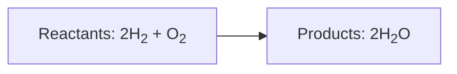
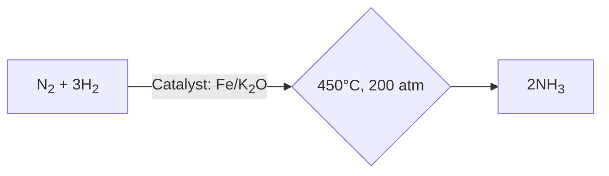
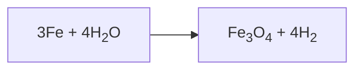

# Introduction to Chemical Equations

Welcome to our presentation on chemical reactions and equations. In this session, we will explore the fundamental concept of chemical reactions, how they are represented by chemical equations, and the diverse types of reactions that occur. Prepare to dive into the fascinating world of chemistry, where you'll learn to decode the language of chemical transformations!

---
transition: fade-out
---

# Table of Contents

- Learning Objectives
- Understanding Chemical Reactions
- Introduction to Chemical Equations
- Types of Chemical Reactions
- Balancing Chemical Equations
- Application and Practice
- Conclusion and Fun Facts

---
transition: fade-out
---

# Learning Objectives

- Define chemical equations and explain their significance.
- Understand how chemical reactions result in the formation of new substances.
- Explore the different types of chemical reactions.
- Learn to balance chemical equations using various methods.
- Apply knowledge through examples and practice questions.

---
transition: fade-out
---

# Understanding Chemical Reactions

- **Definition**: A chemical reaction is a process where reactants are transformed into products with different properties.
- **Identification**: Observations during reactions include changes in state, color, temperature, or gas evolution.

**Examples**:

- Combustion of candle wax: Solid to liquid and gas.

$\text{C}_{25}\text{H}_{52}(s) + 38\text{O}_2(g) \rightarrow 25\text{CO}_2(g) + 26\text{H}_2\text{O}(g)$

- Citric acid and potassium permanganate: Purple to colorless.

$5\text{H}_2\text{C}_6\text{H}_6\text{O}_7(aq) + 2\text{KMnO}_4(aq) + 3\text{H}_2\text{SO}_4(aq) \rightarrow 10\text{CO}_2(g) + 2\text{MnSO}_4(aq) + \text{K}_2\text{SO}_4(aq) + 14\text{H}_2\text{O}(l)$

---
transition: fade-out
---

# Visual Understanding of Chemical Reactions

*[Chemical reactions and equations.](https://cdn1.byjus.com/wp-content/uploads/2016/01/Chemical-Equations-700x257.png)*

---
transition: fade-out
---

# Example: Chemical Equation for Ammonia Synthesis

*[Chemical Equation for Ammonia Synthesis](https://content.instructables.com/F6U/BTZD/IMGLENDK/F6UBTZDIMGLENDK.png?auto=webp&frame=1&width=320&md=MjAxNi0wMy0zMSAxMTo0OTowMC4w)*

---
transition: fade-out
---

# Introduction to Chemical Equations

- **Definition**: Chemical equations are symbolic representations of chemical reactions.
- **Components**:
  - Reactants: Substances that undergo change.
  - Products: New substances formed.

**Example**: 

- Word Equation: Magnesium + Oxygen → Magnesium oxide
- Chemical Equation: $2 \text{Mg} + \text{O}_2 \rightarrow 2 \text{MgO}$

---
transition: fade-out
---

# Writing and Balancing Chemical Equations

- **Writing Equations**:
  - Reactants on the left, Products on the right.
  - Use symbols and formulae.
  - Include physical states.

- **Balancing Steps**:
  - Write the unbalanced equation.
  - Count atoms on both sides.
  - Adjust coefficients to balance.
  - Check balance and simplification.

---
transition: fade-out
---

# Demonstration of Balancing Chemical Equations

*[Balancing Equations](https://i.ytimg.com/vi/UGf60kq_ZDI/hqdefault.jpg)*

---
transition: fade-out
---

# Types of Chemical Reactions

1. **Combination Reaction**: 
   - Two or more reactants form one product. 
   - Example: $C(s) + O_2(g) \rightarrow CO_2(g)$

2. **Decomposition Reaction**: 
   - A compound breaks down into simpler products.

3. **Displacement Reaction**: 
   - More reactive element displaces another. 
   - Example: $Zn(s) + CuSO_4(aq) \rightarrow ZnSO_4(aq) + Cu(s)$

4. **Redox Reactions**: 
   - Involves electron transfer, oxidation, and reduction.

---
transition: fade-out
---

# Balancing Chemical Equations

- **Law of Conservation of Mass**: Matter cannot be created or destroyed.

**Balancing Example**:

- Start: $\text{Fe} + 4\text{H}_2\text{O} \rightarrow \text{Fe}_3\text{O}_4 + \text{H}_2$
  
- Balanced: $3\text{Fe} + 4\text{H}_2\text{O} \rightarrow \text{Fe}_3\text{O}_4 + 4\text{H}_2$

---
transition: fade-out
---

# How to Balance Chemical Equations

  <iframe width="560" height="315" src="https://www.youtube.com/embed/zmdxMlb88Fs?si=e5o9nKUQ4MnmCDdy" title="YouTube video player" frameborder="0" allow="accelerometer; autoplay; clipboard-write; encrypted-media; gyroscope; picture-in-picture; web-share" referrerpolicy="strict-origin-when-cross-origin" allowfullscreen></iframe>

---
transition: fade-out
---

# Application and Practice

- **Practical Examples**: Decomposition of calcium carbonate, displacement of hydrogen by sodium.
  
- **Sample Problems**:
  - Balance: $Zn + H_2SO_4 \rightarrow ZnSO_4 + H_2$
  - Reaction Analysis: Identify reaction type and predict products.

---
transition: fade-out
---

# Quick Revision

  <iframe width="560" height="315" src="https://www.youtube.com/embed/TfXOwxXprtE?si=LQzboxfNTrAxcXIp" title="YouTube video player" frameborder="0" allow="accelerometer; autoplay; clipboard-write; encrypted-media; gyroscope; picture-in-picture; web-share" referrerpolicy="strict-origin-when-cross-origin" allowfullscreen></iframe>

---
transition: fade-out
---

# Conclusion and Fun Facts

- **Conclusion**: Understanding chemical equations is crucial in predicting the products of reactions and ensuring mass conservation.

- **Fun Fact**: The reactions in your stomach including digestion are similar to a mini laboratory working tirelessly inside.

---
transition: fade-out
---

# Questions to Accelerate Thinking

- What similarities can you find between chemical reactions and cooking?
- How would you explain a redox reaction in terms of electron movement?
- Try balancing a challenging equation: $C_4H_{10} + O_2 \rightarrow CO_2 + H_2O$.

---
transition: fade-out
---

# References and Resources

- Learn more with [BYJU's Class 10 Chemistry Notes](https://byjus.com/cbse-notes/chemistry-notes-class-10-chapter-1/)
- Practice with [Class 10 Chemistry Worksheet](https://www.scribd.com/document/473482035/CBSE-Class-10-Chemistry-Worksheet-Chemical-Reactions-And-Equations)
- For visual learners, visit [YouTube Video: Balancing Chemical Equations](https://www.youtube.com/watch?v=ruHwWNLgBV4). 