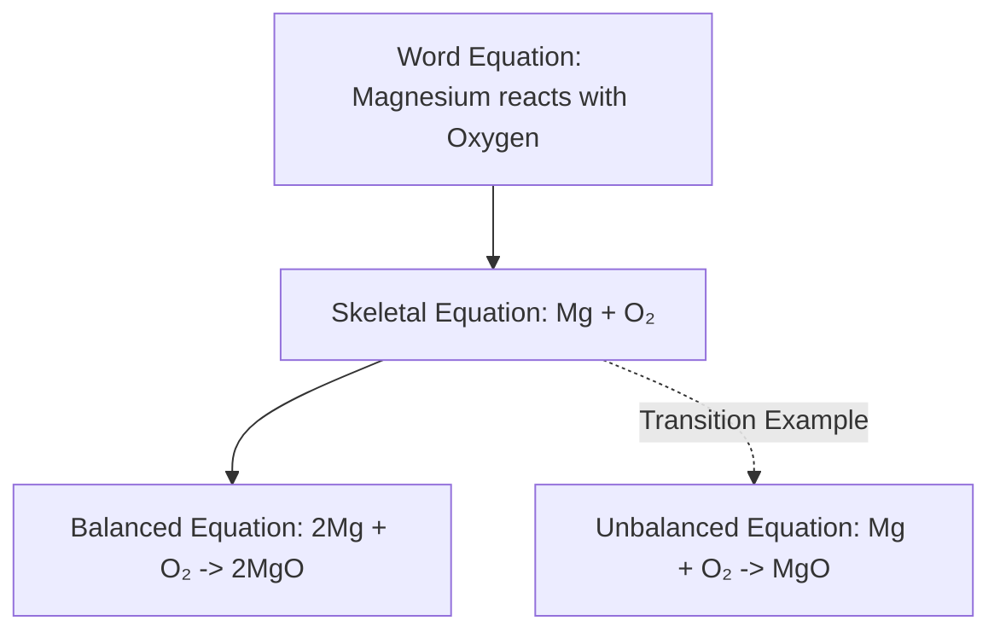
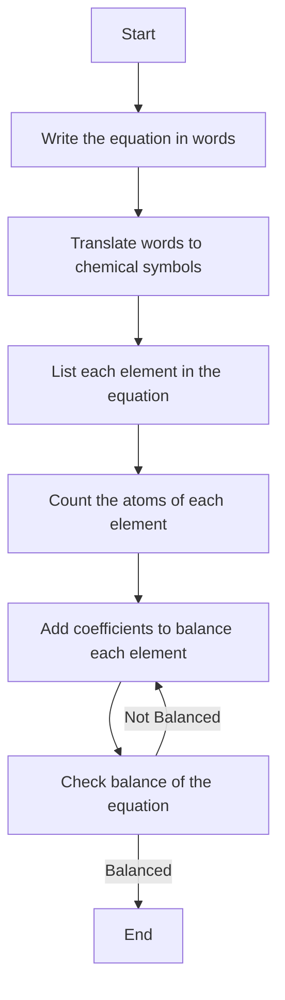
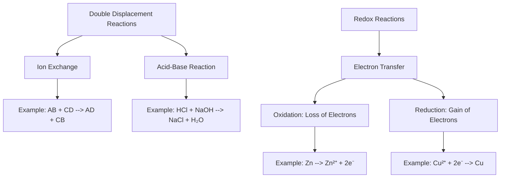
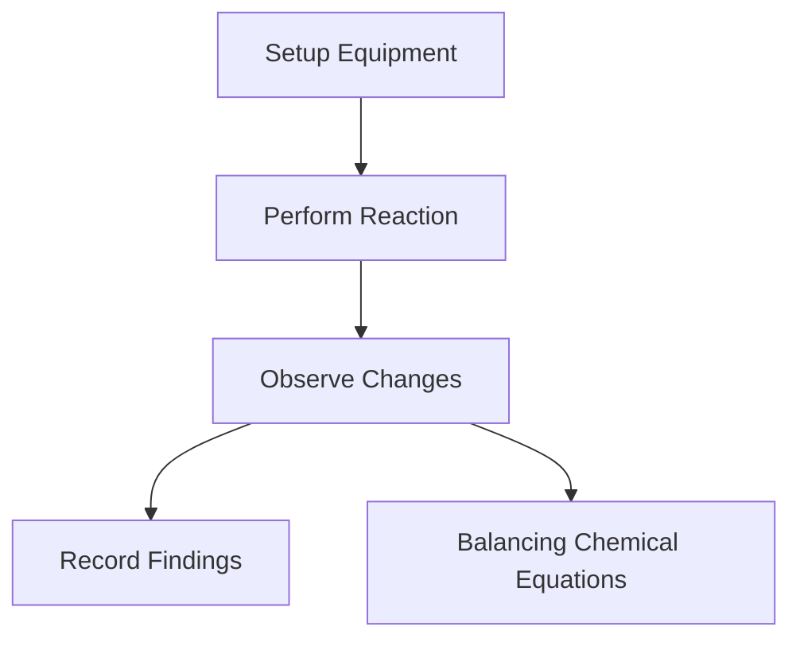

# Introduction to Chemical Reactions and Equations

**Learning Objectives:**
- Define chemical equations & explain their usefulness
- Explain substance formation by chemical reactions
- Discuss benefits of chemical equations
- Describe direct combination reactions
- Identify components of direct combination reactions

---
layout: image-right
title: Chemical Reactions
image: https://www.thoughtco.com/thmb/BvoqI4sx98BYkrmGinbubaOSV3k=/1500x0/filters:no_upscale():max_bytes(150000):strip_icc()/TC_608334-chemical-change-examples-5aabebea31283400371a753e.png
---

# Chemical Reactions

### 
Processes Transforming Substances

- Chemical reactions change original substances into new ones with different properties.
- Reactants and products are distinguished by change indicators like state or color change.
**Examples:**
1. State Change: Combustion of candle wax
2. Color Change: Citric acid & potassium permanganate
3. Gas Evolution: Zinc & dilute sulphuric acid
4. Temperature Change: Quicklime & water
---
layout: cover
title: Understanding Chemical Equations
background: https://fal.media/files/lion/kw21t0cO6pNU1POG4U7Vu_c62c23ed3b5249f090b8b0e6bb421b13.jpg
---

# Understanding Chemical Equations

Chemical equations provide a concise way to represent chemical reactions using symbols and formulas. This slide covers word equations, skeletal equations, and balancing using LaTeX equations.

---
layout: two-cols
---

# Components of Chemical Equations

### 
From Word to Skeletal to Balanced

- **Word Equations:** Simplified reaction description
- **Skeletal Equations:** Symbols and formulas, no balancing
- **Balanced Equations:** Atom conservation with numeric balancing
- **Example Equations in LaTeX:**
  1. $2Mg + O_2 \rightarrow 2MgO$
  2. $Mg + O_2 \rightarrow MgO$

::right::

---
layout: cover
title: Writing and Balancing Chemical Equations
background: https://fal.media/files/kangaroo/B0PETtjb70AQYZ9vTAoqY_bb3b347ebf8249e1b1f6c32f035bbda1.jpg
---

# Writing and Balancing Chemical Equations

This section covers how to formulate and balance equations according to the conservation of mass. It includes steps for writing equations and types of reactions.

---
layout: two-cols
---

# Steps and Types of Chemical Reactions

### 
From Word Equations to Balanced Equations

- **Writing Steps**: Describe in words, replace with symbols, identify physical states, simplify.
- **Reaction Types**: Combination & Displacement, e.g. $C+O_2 \rightarrow CO_2$. 
- **Balancing Steps**: Count atoms, balance starting with maximum atoms, check balance.

::right::

---
layout: two-cols
---

# Advanced Concepts in Chemical Reactions

### 
Double Displacement and Redox Reactions

- **Double Displacement Reaction:**
  - Exchange of ions between two compounds
  - Example: $Na_2SO_4 + BaCl_2 \rightarrow BaSO_4 + 2NaCl$
- **Redox Reactions:**
  - Transfer of electrons
  - Oxidation = loss of electrons
  - Reduction = gain of electrons
  - Example: $CuO + H_2 \rightarrow Cu + H_2O$

::right::

---
layout: default
---

# Energy Changes in Reactions

### 
Exothermic and Endothermic Reactions

- **Exothermic Reactions:**
  - Release heat
  - Example: Combustion of natural gas
- **Endothermic Reactions:**
  - Absorb heat
  - Example: Photosynthesis

---
layout: two-cols
---

# Case Studies and Practical Applications

### 
Exploring Chemical Reactions in Laboratories

- **Laboratory Practices**: Simulate reactions like $BaCl_2 + Na_2SO_4 \rightarrow BaSO_4 + 2NaCl$
- **Observation of Changes**: Color change, gas evolution, precipitate formation
- **Common Mistakes**: Importance of balanced equations, accurate observations
- **Practical Considerations**: Safety, equipment, and monitoring

::right::

---
layout: default
---

# Ensuring Laboratory Efficiency and Safety

### 
Guidelines for School Chemistry Labs

- **Well-Equipped Laboratories**: Essential for efficient learning
- **Ventilation Systems**: Critical for safety
- **Student Monitoring**: Teachers should supervise to prevent accidents
- **Best Practices**: Emphasize safe handling and use of chemicals
